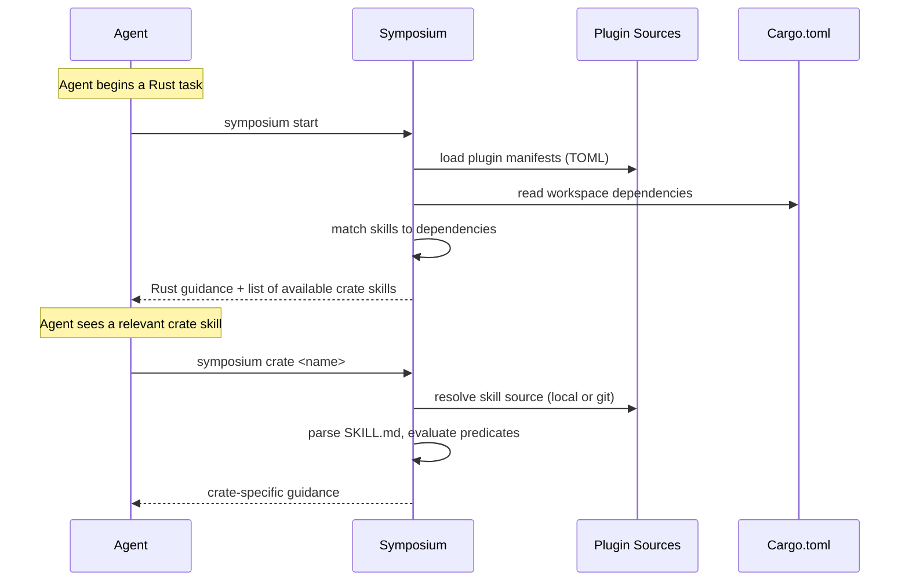

# Symposium start flow

When the agent starts a Rust task, a static skill (installed by the Claude Code plugin) tells it to run `symposium start`. The resulting message (a) lists skills that are available for the workspcae and (b) encourages the agent to run `symposium crate` to look a particular crate.

The start command returns general Rust guidance plus a list of skills that match the workspace's dependencies. The agent can then load individual crate skills as needed. Skills marked `always` are inlined in the start output; `optional` skills are listed with metadata so the agent can choose when to load them.

**Skill resolution** works in layers: plugin sources (configured in `config.toml`) provide plugin manifests, each manifest declares skill groups with crate predicates, and each `SKILL.md` can further narrow with its own `crates` frontmatter. Both levels must match (AND logic), which avoids fetching skill directories that can't possibly apply.
